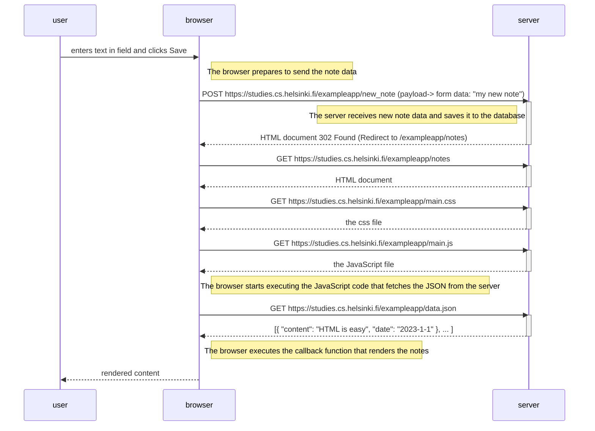

```mermaid
sequenceDiagram
    participant user
    participant browser
    participant server

    user->>browser: enters text in field and clicks Save
    Note right of browser: The browser prepares to send the note data

    browser->>server: POST https://studies.cs.helsinki.fi/exampleapp/new_note (payload-> form data: "my new note")
    activate server
    Note left of server: The server receives new note data and saves it to the database

    server-->>browser: HTML document 302 Found (Redirect to /exampleapp/notes)
    deactivate server

    browser->>server: GET https://studies.cs.helsinki.fi/exampleapp/notes
    activate server
    server-->>browser: HTML document
    deactivate server

    browser->>server: GET https://studies.cs.helsinki.fi/exampleapp/main.css
    activate server
    server-->>browser: the css file
    deactivate server

    browser->>server: GET https://studies.cs.helsinki.fi/exampleapp/main.js
    activate server
    server-->>browser: the JavaScript file
    deactivate server

    Note right of browser: The browser starts executing the JavaScript code that fetches the JSON from the server

    browser->>server: GET https://studies.cs.helsinki.fi/exampleapp/data.json
    activate server
    server-->>browser: [{ "content": "HTML is easy", "date": "2023-1-1" }, ... ]
    deactivate server

    Note right of browser: The browser executes the callback function that renders the notes

    browser-->>user: rendered content

```