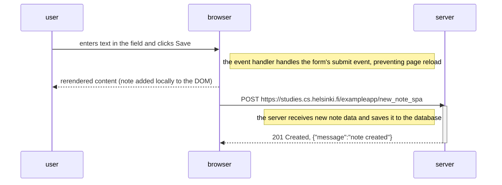

```mermaid
sequenceDiagram
    participant user
    participant browser
    participant server

    user->>browser: enters text in the field and clicks Save
    Note right of browser: the event handler handles the form's submit event, preventing page reload

    browser-->>user: rerendered content (note added locally to the DOM)

    browser->>server: POST https://studies.cs.helsinki.fi/exampleapp/new_note_spa

    activate server
    Note left of server: the server receives new note data and saves it to the database
    server-->>browser: 201 Created, {"message":"note created"}
    deactivate server
```